# 🎻 Agent Symphony - AI-Powered Multi-Exchange Trading System

<div align="center">

[](https://cloud.google.com)
[](https://python.org)
[](https://typescriptlang.org)
[](LICENSE)

**Agent Symphony** is an enterprise-grade AI trading system that orchestrates multiple autonomous trading agents across Aster and Hyperliquid exchanges using a central AI "Conductor" for market analysis and coordination.

[Live Dashboard](https://sapphiretrade.xyz) • [Documentation](docs/) • [Architecture](#architecture)

</div>

---

## 🏗️ Architecture Overview

The system follows a **Conductor-Orchestra** pattern where a central AI analyst coordinates multiple specialized trading agents:

```mermaid
flowchart TB
    subgraph "🧠 Intelligence Layer"
        CONDUCTOR[Symphony Conductor<br/>Gemini AI]
        PUBSUB[(Google Pub/Sub<br/>Market Regime)]
    end

    subgraph "⚡ Execution Layer"
        CT[Cloud Trader<br/>Aster Exchange]
        HT[Hyperliquid Trader<br/>Hyperliquid Exchange]
    end

    subgraph "📊 Visualization Layer"
        DASH[Trading Dashboard<br/>React + WebSocket]
        TG[Telegram Bot<br/>Notifications]
    end

    subgraph "🔐 Infrastructure"
        REDIS[(Redis<br/>State Cache)]
        PG[(PostgreSQL<br/>Trade History)]
        SM[Secret Manager<br/>API Keys]
    end

    CONDUCTOR -->|Publishes Regime| PUBSUB
    PUBSUB -->|Subscribes| CT
    PUBSUB -->|Subscribes| HT
    CT -->|WebSocket| DASH
    CT -->|Notifications| TG
    CT <-->|State| REDIS
    CT -->|Trades| PG
    SM -->|Secrets| CT
    SM -->|Secrets| HT
```



---

## 🎯 Core Components

| Component | Description | Technology |
|-----------|-------------|------------|
| **Symphony Conductor** | AI market analyst that determines global market regime (Bull/Bear/Volatile) | Python, Gemini AI |
| **Cloud Trader** | Main trading engine with 7+ specialized AI agents | Python, FastAPI, AsyncIO |
| **Hyperliquid Trader** | High-frequency trading on Hyperliquid | Python, HFT optimized |
| **Trading Dashboard** | Real-time visualization with live P&L and positions | React, TypeScript, WebSocket |
| **Symphony Lib** | Shared data models and Pub/Sub client | Python dataclasses |

---

## 🤖 Trading Agents


Each agent has:
- **Unique Strategy**: Tailored for specific market conditions
- **Risk Controls**: Individual circuit breakers and loss limits
- **AI Analysis**: Uses Gemini/Grok for trade decisions
- **Emoji Identity**: Visual identification in logs and dashboard

---

## 📁 Project Structure

```
AIAster/
├── symphony_conductor/      # 🧠 Market Analysis Service
│   └── conductor.py         # Gemini-powered regime detection
├── cloud_trader/            # ⚡ Main Trading Engine
│   ├── trading_service.py   # Core trading loop
│   ├── enhanced_telegram.py # AI-powered notifications
│   ├── position_manager.py  # Position tracking
│   ├── market_data.py       # Exchange data fetching
│   └── agents/              # Individual agent strategies
├── hyperliquid_trader/      # 🚀 HFT Exchange Service
├── trading-dashboard/       # 📊 React Frontend
│   ├── src/components/      # UI components
│   ├── src/hooks/           # WebSocket & data hooks
│   └── src/pages/           # Dashboard views
├── symphony_lib/            # 📚 Shared Models
├── terraform/               # 🏗️ Infrastructure as Code
├── docs/                    # 📖 Documentation
└── cloudbuild*.yaml         # 🔄 CI/CD Configs
```

---

## 🚀 Deployment

### Prerequisites
- Google Cloud SDK (`gcloud`)
- Docker
- Node.js 18+ (for frontend)
- Python 3.11+

### Quick Deploy

```bash
# Deploy all services
gcloud builds submit --config cloudbuild_trader.yaml .     # Backend
gcloud builds submit --config cloudbuild_conductor.yaml .   # AI Conductor
cd trading-dashboard && npm run deploy                      # Frontend
```

### Environment Variables

| Variable | Description | Required |
|----------|-------------|----------|
| `GCP_PROJECT_ID` | Google Cloud project ID | ✅ |
| `ASTER_API_KEY` | Aster exchange API key | ✅ |
| `ASTER_SECRET_KEY` | Aster exchange secret | ✅ |
| `GEMINI_API_KEY` | Google Gemini AI key | ✅ |
| `TELEGRAM_BOT_TOKEN` | Telegram notifications | ⚠️ |
| `REDIS_URL` | Redis connection string | ✅ |
| `DATABASE_URL` | PostgreSQL connection | ✅ |

---

## 📊 Data Flow


---

## 🔒 Security

- **Secret Manager**: All API keys stored in GCP Secret Manager
- **VPC Connector**: Static IP for exchange whitelisting
- **IAM**: Least-privilege service accounts
- **Audit Logging**: All trades logged to BigQuery

---

## 📈 Monitoring

| Tool | Purpose | Link |
|------|---------|------|
| Cloud Logging | Service logs | GCP Console |
| Prometheus | Metrics collection | `/metrics` endpoint |
| Telegram | Real-time alerts | Bot notifications |
| Dashboard | Visual monitoring | [sapphiretrade.xyz](https://sapphiretrade.xyz) |

---

## 🛠️ Development

### Local Setup

```bash
# Clone and setup
git clone https://github.com/arigatoexpress/AsterAI.git
cd AsterAI
python -m venv venv && source venv/bin/activate
pip install -e .

# Run locally
python -m cloud_trader.api
```

### Testing

```bash
pytest tests/ -v
```

---

## 📚 Documentation

- [Architecture Deep Dive](docs/ARCHITECTURE.md)
- [Deployment Checklist](docs/DEPLOYMENT_CHECKLIST.md)
- [Multi-Agent Features](docs/MULTI_AGENT_FEATURES.md)
- [Security Review](docs/security_review.md)

---

## 📄 License

Proprietary - All Rights Reserved

---

<div align="center">
<sub>Built with ❤️ by the Sapphire Team</sub>
</div>
