# 🏗️ Agent Symphony Architecture

## Table of Contents
- [System Overview](#system-overview)
- [Component Deep Dive](#component-deep-dive)
- [Data Flow](#data-flow)
- [Trading Loop](#trading-loop)
- [Agent System](#agent-system)
- [Infrastructure](#infrastructure)

---

## System Overview

Agent Symphony is a distributed trading system built on a **Conductor-Orchestra** pattern:


---

## Component Deep Dive

### 1. Symphony Conductor (`symphony_conductor/`)

**Purpose**: Central AI brain that analyzes market conditions and publishes regime signals.


**Key Files**:
- `conductor.py` - Main service loop
- `Dockerfile` - Container configuration

**Market Regimes**:
| Regime | Description | Agent Behavior |
|--------|-------------|----------------|
| `BULL_TRENDING` | Strong uptrend | Aggressive longs |
| `BULL_VOLATILE` | Bullish with swings | Momentum plays |
| `BEAR_TRENDING` | Downtrend | Short positions |
| `BEAR_VOLATILE` | Bearish with swings | Quick exits |
| `RANGE_BOUND` | Sideways market | Mean reversion |

---

### 2. Cloud Trader (`cloud_trader/`)

**Purpose**: Main trading engine managing multiple AI agents on Aster Exchange.


**Key Files**:
| File | Purpose |
|------|---------|
| `trading_service.py` | Core trading loop, agent coordination |
| `position_manager.py` | Position tracking and sync |
| `market_data.py` | Exchange data fetching |
| `enhanced_telegram.py` | AI-powered notifications |
| `client.py` | Aster exchange API client |
| `config.py` | Settings and symbol config |

---

### 3. Trading Dashboard (`trading-dashboard/`)

**Purpose**: Real-time visualization of system performance.


**Key Features**:
- Real-time P&L tracking
- Agent performance cards
- Position management grid
- Market regime indicator
- Trade history

---

### 4. Symphony Lib (`symphony_lib/`)

**Purpose**: Shared data models and Pub/Sub utilities.

```python
@dataclass
class MarketRegime:
    regime: str              # BULL_TRENDING, BEAR_VOLATILE, etc.
    confidence: float        # 0.0 - 1.0
    trend_strength: float
    volatility_level: float
    timestamp_us: int
```

---

## Data Flow

### Market Regime Flow


### Trade Execution Flow


---

## Trading Loop

The main trading loop runs every 5 seconds:


### Execute Agent Trading Logic


---

## Agent System

### Agent Definitions

```mermaid
graph TB
    subgraph Bull Agents
        A1[🐂 Momentum Hunter<br/>Trend following]
        A2[⚡ Breakout Sniper<br/>Key level breaks]
        A3[🏄 Trend Surfer<br/>Ride extended moves]
    end

    subgraph Bear Agents
        B1[🌊 Volatility Harvester<br/>Vol spikes]
        B2[📊 Mean Reversion<br/>Oversold bounces]
    end

    subgraph Special Agents
        S1[🧠 Grok Alpha<br/>Advanced reasoning]
        S2[🐋 Whale Tracker<br/>Large player mimicry]
    end
```



### Agent State Machine


---

## Infrastructure

### Google Cloud Architecture


### Deployment Pipeline


---

## Security Model


---

## Scaling Considerations

| Component | Current | Scalable To |
|-----------|---------|-------------|
| Cloud Trader Instances | 1 | 10+ (stateless) |
| Redis | 1GB | 300GB (Memorystore) |
| PostgreSQL | 10GB | 10TB (Cloud SQL) |
| Pub/Sub | Unlimited | Unlimited |

---

## Monitoring Stack


---

<div align="center">
<sub>Architecture documentation last updated: December 2025</sub>
</div>
