# 📐 Agent Symphony: Technical Specification

## Abstract

Agent Symphony is a distributed, event-driven trading system implementing a **Conductor-Orchestra** architectural pattern for autonomous multi-exchange cryptocurrency trading. The system leverages Large Language Models (LLMs) for market regime classification and trade signal generation, achieving real-time execution with sub-second latency.

---

## 1. System Architecture

### 1.1 Architectural Pattern: Conductor-Orchestra

The system employs a hierarchical control structure inspired by musical orchestras:

```
                    ┌─────────────────────┐
                    │   CONDUCTOR LAYER   │
                    │   (Market Analysis) │
                    └──────────┬──────────┘
                               │ Pub/Sub
            ┌──────────────────┼──────────────────┐
            ▼                  ▼                  ▼
    ┌───────────────┐  ┌───────────────┐  ┌───────────────┐
    │  TRADER A     │  │  TRADER B     │  │  TRADER N     │
    │  (Aster)      │  │  (Hyperliquid)│  │  (Future)     │
    └───────────────┘  └───────────────┘  └───────────────┘
            │                  │                  │
    ┌───────┴───────┐  ┌───────┴───────┐
    │    AGENTS     │  │    AGENTS     │
    │ (7+ per svc)  │  │ (N per svc)   │
    └───────────────┘  └───────────────┘
```

### 1.2 Component Responsibilities

| Component | Function | Technology |
|-----------|----------|------------|
| **Conductor** | Global market regime classification | Gemini 1.5 Flash |
| **Cloud Trader** | Multi-agent trade execution on Aster | Python 3.11, FastAPI |
| **Hyperliquid Trader** | HFT execution on Hyperliquid | Python, WebSocket |
| **Dashboard** | Real-time visualization | React 18, TypeScript |

---

## 2. Trading Algorithm

### 2.1 Decision Flow

The trading loop executes a 5-second cycle with the following state machine:

```mermaid
stateDiagram-v2
    [*] --> AgentSelection
    AgentSelection --> SymbolSelection
    SymbolSelection --> PositionCheck

    PositionCheck --> ManagePosition: Has Position
    PositionCheck --> MarketAnalysis: No Position

    ManagePosition --> ProfitCheck
    ProfitCheck --> ClosePosition: TP/SL Hit
    ProfitCheck --> HoldPosition: Continue

    MarketAnalysis --> SignalEvaluation
    SignalEvaluation --> OpenPosition: Confidence ≥ 0.65
    SignalEvaluation --> Skip: Confidence < 0.65

    ClosePosition --> [*]
    HoldPosition --> [*]
    OpenPosition --> [*]
    Skip --> [*]
```



### 2.2 Signal Generation

Market analysis uses a multi-factor scoring model:

$$
\text{Signal} = \begin{cases}
\text{BUY} & \text{if } \sum_{i=1}^{n} w_i \cdot f_i > \theta_{buy} \\
\text{SELL} & \text{if } \sum_{i=1}^{n} w_i \cdot f_i < \theta_{sell} \\
\text{HOLD} & \text{otherwise}
\end{cases}
$$

Where:
- $f_i$ = Feature score (momentum, RSI, MACD, volume, etc.)
- $w_i$ = Feature weight (learned or configured)
- $\theta$ = Decision threshold

### 2.3 Position Sizing

Notional size is calculated dynamically:

$$
\text{Notional} = \$150 \times (0.8 + 0.4 \times \text{confidence})
$$

This yields a range of **$120 - $210** per position, scaling with signal confidence.

---

## 3. Agent System

### 3.1 Agent Taxonomy

Agents are classified by market condition specialization:

```mermaid
graph TB
    subgraph "Bull Market Agents"
        A1["🐂 Momentum Hunter<br/>Trend following"]
        A2["⚡ Breakout Sniper<br/>Support/Resistance breaks"]
        A3["🏄 Trend Surfer<br/>Extended moves"]
    end

    subgraph "Bear Market Agents"
        B1["🌊 Volatility Harvester<br/>Vol expansion"]
        B2["📊 Mean Reversion<br/>Oversold conditions"]
    end

    subgraph "Quantitative Agents"
        Q1["⚡ VPIN HFT<br/>Volume-informed trading"]
        Q2["🧠 Strategy Optimizer<br/>Meta-learning"]
    end
```



### 3.2 Agent State Machine

Each agent maintains independent state:

```python
@dataclass
class AgentState:
    id: str                    # Unique identifier
    name: str                  # Display name
    emoji: str                 # Visual identifier
    active: bool = True        # Participation flag
    daily_loss_breached: bool = False  # Circuit breaker
    symbols: List[str] = None  # Symbol restrictions (optional)
```

### 3.3 Risk Controls

| Control | Threshold | Action |
|---------|-----------|--------|
| Daily Loss Limit | -$500 | Pause agent for day |
| Position Size | 3x base | Cap additions |
| Stale Position | 4 hours | Close if <0.5% move |
| Liquidation Risk | Margin <5% | Emergency close |

---

## 4. Market Regime Classification

### 4.1 Regime Types

The Conductor classifies market conditions into discrete regimes:

| Regime | Characteristics | Agent Behavior |
|--------|-----------------|----------------|
| `BULL_TRENDING` | ADX > 25, Price > MA | Aggressive longs |
| `BULL_VOLATILE` | VIX high, Upward bias | Quick scalps |
| `BEAR_TRENDING` | ADX > 25, Price < MA | Short positions |
| `BEAR_VOLATILE` | VIX high, Downward bias | Defensive |
| `RANGE_BOUND` | ADX < 20, Bollinger squeeze | Mean reversion |

### 4.2 Classification Algorithm

Using Gemini 1.5 Flash with structured output:

```python
prompt = f"""
Analyze the following market data and classify the regime:

BTC Price: ${btc_price}
24h Change: {change_pct}%
RSI(14): {rsi}
ADX(14): {adx}

Output JSON: {{"regime": "<value>", "confidence": <0-1>}}
"""
```

---

## 5. Infrastructure

### 5.1 Deployment Topology


### 5.2 Networking

| Component | IP/Domain | Purpose |
|-----------|-----------|---------|
| Static NAT IP | 34.118.185.110 | Exchange whitelisting |
| Redis | 10.30.22.187:6379 | State cache |
| PostgreSQL | 10.127.2.3:5432 | Trade persistence |

### 5.3 Secret Management

All credentials stored in GCP Secret Manager:

| Secret | Description |
|--------|-------------|
| `ASTER_API_KEY` | Exchange authentication |
| `ASTER_SECRET_KEY` | Exchange signing |
| `GEMINI_API_KEY` | AI model access |
| `TELEGRAM_BOT_TOKEN` | Notification delivery |
| `TELEGRAM_CHAT_ID` | Notification target |

---

## 6. Performance Metrics

### 6.1 Latency Budget

| Stage | Target | Measured |
|-------|--------|----------|
| Market data fetch | < 100ms | ~50ms |
| AI analysis | < 500ms | ~300ms |
| Order execution | < 200ms | ~100ms |
| Total loop | < 1s | ~500ms |

### 6.2 Throughput

- **Trading Loop**: 12 iterations/minute
- **Positions Managed**: Up to 50 concurrent
- **Symbols Scanned**: 248 pairs

---

## 7. Error Handling

### 7.1 Retry Strategy

```python
async def execute_with_retry(func, max_retries=3):
    for attempt in range(max_retries):
        try:
            return await func()
        except RateLimitError:
            await asyncio.sleep(2 ** attempt)
        except TemporaryError:
            continue
    raise MaxRetriesExceeded()
```

### 7.2 Circuit Breakers

- **Daily Loss**: Pauses agent after cumulative loss threshold
- **Consecutive Errors**: Restarts loop after 5 failures
- **Liquidation Risk**: Emergency position closure

---

## 8. Monitoring & Observability

### 8.1 Logging

All services emit structured logs to Cloud Logging:

```json
{
  "severity": "INFO",
  "message": "🚀 NEW TRADE: ⚡ VPIN HFT Agent -> BUY BTCUSDT",
  "labels": {
    "service": "cloud-trader",
    "agent": "vpin-hft",
    "symbol": "BTCUSDT"
  }
}
```

### 8.2 Metrics Exposed

| Metric | Type | Description |
|--------|------|-------------|
| `trades_executed_total` | Counter | Total trades |
| `position_pnl_dollars` | Gauge | Current P&L |
| `loop_duration_seconds` | Histogram | Loop latency |

---

## 9. References

1. Hasbrouck, J. (2007). *Empirical Market Microstructure*
2. Google Cloud Architecture Framework
3. Gemini API Documentation
4. Aster Exchange API Specification

---

<div align="center">
<sub>Technical Specification v1.0 | December 2025</sub>
</div>
